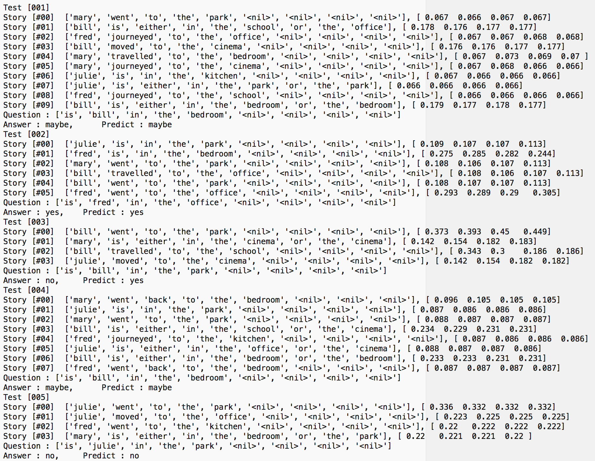
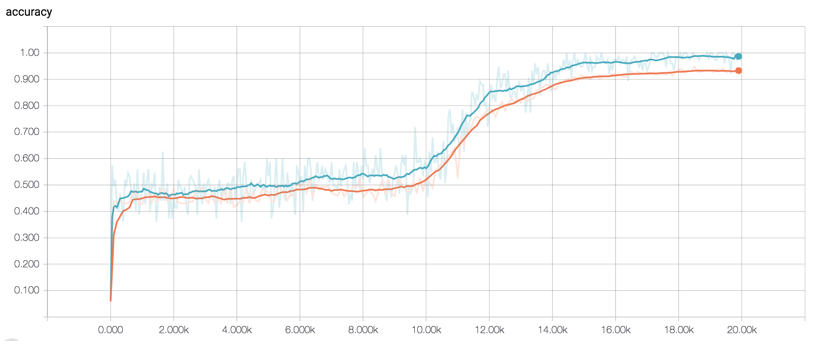
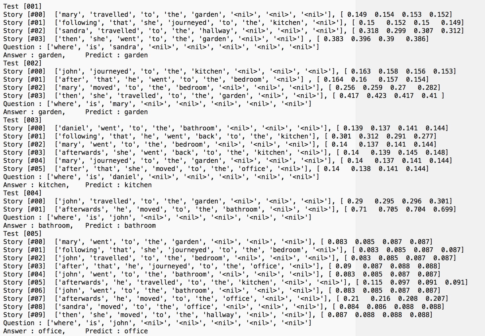
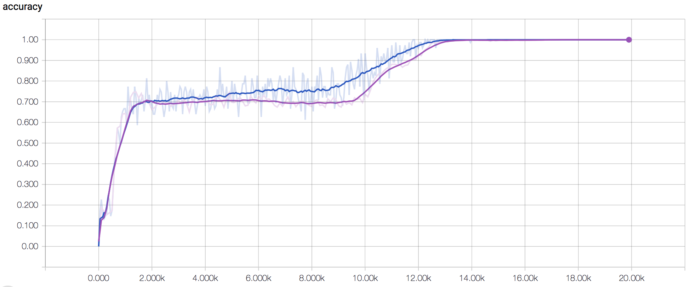
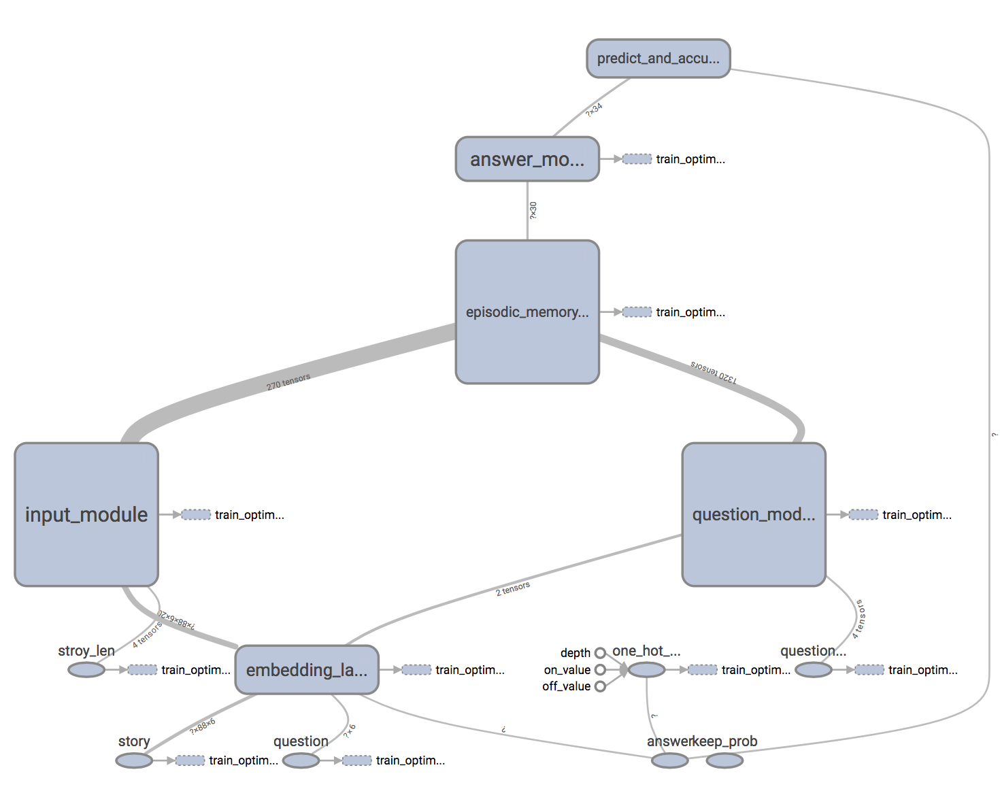

# Implementation of Dynamic Memory Networks for QA System using Tensorflow  
  
#### cuteboydot@gmail.com  
  
#### reference  
1. [Ask Me Anything:Dynamic Memory Networks for Natural Language Processing](https://arxiv.org/pdf/1506.07285.pdf)  
  
### Test result  
본 프로젝트는 총 20종류의 데이터 중, 10번(indefinite-knowledge)과 11번(basic-coreference) 내용을 사용하였다.  
실험 환경은 다음과 같다.  
- python 3.6  
- tensorflow 1.3  
- data size for train : 10,000 (qa10, qa11 각각)  
- data size for test : 1,000 (qa10, qa11 각각)  
- number of hop : 4  
- embedding dim : 20  
- RNN state dim : 30  
- attention dim : 30
- total epochs : 150  
- batch size : 75  
- learngin rate : 0.001  
  
#### qa10 : indefinite knowledge  
  
  
  
#### qa11 : basic coreference  
  
  
  
#### Tensorflow Graph  
  
